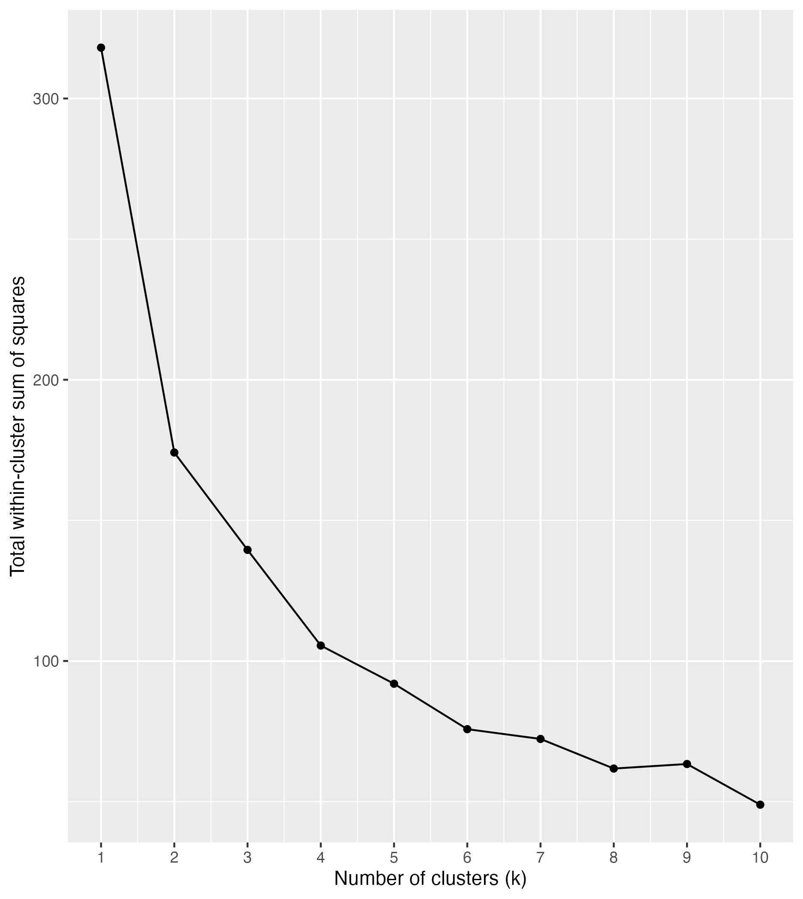
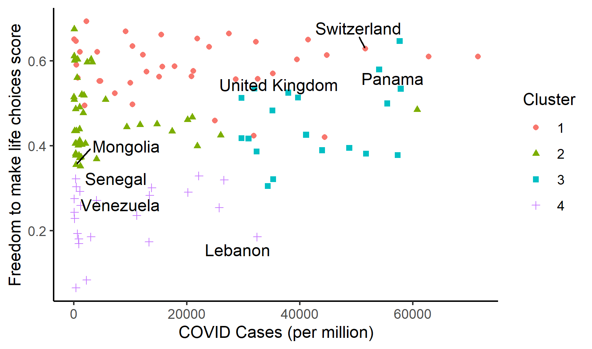
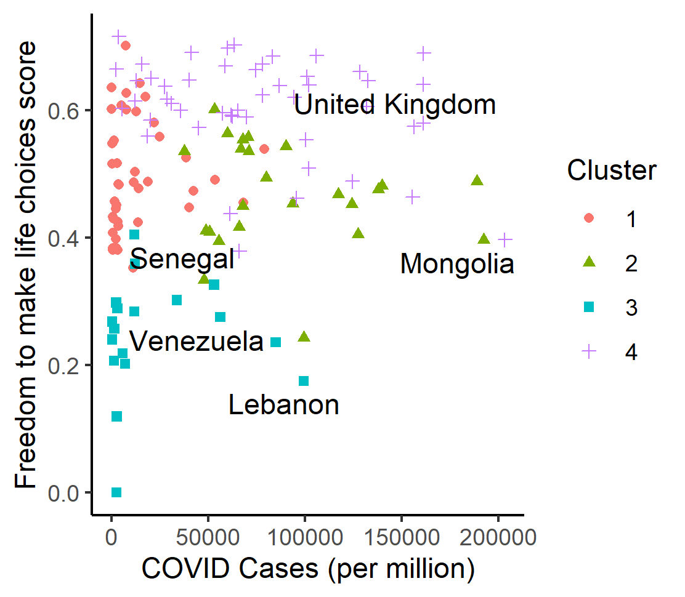
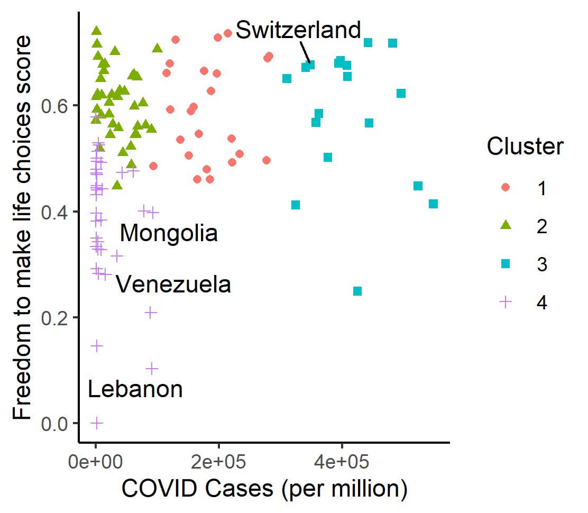

```{r setup, include = FALSE}
# Set code chunk defaults 
# Consider adding `message = FALSE` option
knitr::opts_chunk$set(echo = FALSE) 
                      
# Set R environment options
options(knitr.kable.NA = '')

# Load packages
library(tidyverse)
library(ggplot2)
library(htmlwidgets)
library(plotly)
library(leaflet)
library(viridis)
library(htmlwidgets)
library(plotly)
library(gganimate)
library(gifski)
library(wordcloud)
```

# Introduction

```{r, fig.cap='SARS-CoV-2 Virus. Taken from the Center for Disease Control and Prevention.', out.width="100%", fig.align="center"}
# Adds picture of COVID virus
knitr::include_graphics("img/covid_virus_pic.avif")
```

During the COVID-19 pandemic, each country underwent the trails and tribulations of deciding how much they should govern their citizens to keep them healthy. Some countries erred on the side of safety, some on the side of freedom, some tried to walk the line. How did they implement these strategies and how well did they work?

In this project, we examined the relationship between the stringency of a country's COVID policy, i.e. the relative freedom allowed the people of the country during the COVID pandemic, and the per capita number of COVID cases that occurred in that country. We also observed how the levels of freedom and corresponding COVID case numbers changed over the three year course of the pandemic for which we have data, i.e. how responses shifted from the 2020 beginnings of the pandemic, to 2021, and up to 2022. To do so, we clustered countries by total number of deaths, total number of cases, and overall happiness score, and, based on these groupings at the start of the pandemic (2020 data) chose a country to examine. Additional countries were selected to ensure that nearly all continents (barring Antarctica, Australia, and North America) were included. For a country to be considered for further examination, they had to have data for all three years (no North American Country met this requirement, and thus was excluded) and had to have readily available text resources on their COVID policy. Otherwise, countries were chosen at random in an attempt to encompass a broader range of country experiences. We then performed text analysis on the COVID policies of these chosen countries to identify the most commonly used words in their COVID policies, to examine what regulations were present, and how this might have effected their per capita rate of COVID 19 infection within their country. We used COVID 19 data and data from World Happiness Report (which can be found in our reference section) to examine these questions. 


# Freedom According to the World Happiness Report vs COVID Cases (Scatterplot)

CLICK ON THE PLOT TO VIEW THE NAMES OF SPECIFIC COUNTRIES. 

In the SHINY App portion of our project, we observed (see below) that there appeared to be a relationship where in countries with a higher number of COVID cases appeared to correspond to countries that scored higher on the World Happiness Report in the "Freedom to Make Life Decisions" category (a higher "Freedom to Make Life Decisions" corresponds to a higher degree of freedom in that country). This effect was most pronounced in 2022 (a number of years into the pandemic, indeed the latest year we studied) where the number of cases appeared to increase above levels of 2020 and 2021, particularly in countries with higher "Freedom to Make Life Decision" scores. It occurred to us that in the early year of the pandemic, even countries that typically scored high on the "Freedom to Make Life Decisions" indicators of the World Happiness Report when faced with a never-before-seen threat to their people, may have responded more strictly to the unknown that was the pandemic. However, as time went on, we wondered if perhaps the COVID regulations imposed by various governments were swayed by their more typical "freedom leanings" as measured by the World Happiness Report, and that countries with more "Freedom the Make Life Decisions" relaxed their COVID mandates more quickly, leading to surges in COVID cases during the later years of the pandemic (particularly 2022). This lead us to the desire to look at "Freedom to Make Life Decision Scores" within each country over the course of the pandemic to see if they took into account COVID policy and how they might have changed during the pandemic. 

```{r, warning = FALSE, message = FALSE}
# Reading in data for the scatterplot 
scatterplot_data <- readRDS("data/scatterplot_data_without_2019.rds") 

# Making the scatterplot
cases_vs_freedom_plot <- ggplot(data = scatterplot_data 
           , aes_string( # Maps aesthetics from strings
             x = "`Freedom to make life choices`", # Maps x variable to Freedom to make life choice
             y = "tot_year_cases", # Maps y variable to COVID Cases per million
             color = "year", # Maps color to year
             label = "Country")) + # Maps label to country
      geom_point(size = 1.5) + # Adds points to the plot of size 1.5 and color blue
      labs(x = "Freedom to Make Life Choices Score" # Sets the x axis label
           , y = "COVID Cases (per million)" # Sets the y axis label
           , title = "Country Freedom to Make Life Choices in Relation to COVID19 Cases" # Sets the title
           , subtitle = "Pandemic Years 2020-2022"
           , color = "Year") + # Sets the subtitle
      geom_smooth(method = "lm" # Adds line of best fit to the plot
                  , se = FALSE # Gets rid of confidence interval
                  , na.rm = TRUE) # Gets rid of any missing values without a warning

ggplotly(cases_vs_freedom_plot, tooltip = "Country") # Makes plot interactive so 
#user can brush over point and see what country it belongs to and year (based on color)

```


# Freedom of Countries Accross the World According to the World Happiness Report (Maps)

```{r}
# Reads in our world map datasets
world_happiness_map <- readRDS("data/world_happiness_map.rds") 
world_happiness_map2 <- readRDS("data/world_happiness_map2.rds") 
```

We first looked at a map of world "Freedom to Make Life Decision" scores in 2019, while COVID-19 was still mainly sequestered in mainland China and not the rest of the world, so that we could examine what various country freedoms looked like prior to the pandemic and compare them to pandemic levels to see how well the Happiness Report measure of "Freedom to Make Life Decisions" captured/accounted for changes in policy based on COVID 19.

```{r}
# Plots the 2019 data for comparison with other years (as flashed through in the below animation)
ggplot(data = world_happiness_map, aes(geometry = geom, fill = `freedom to make choices`)) +
  geom_sf()+
  theme_void() + # removes axes
  # more informative plot/legend/caption titles
  labs(title = "World Freedom to Make Life Choices in 2019"
       , caption = "Data from Our World in Data and World Happiness Report (2019-2022)"
       , fill = "Freedom to Make Life Choices", "Score") +
  # coloring to make chloropleth more readable
  scale_fill_viridis(option = "mako", direction = -1)

```


Pre-pandemic, countries that scored highly on the "Freedom to Make Life Decisions Scores" included all the North American countries, Australia, China, India,Saudi Arabia, the Nordic countries, southwest Africa, all of South America except Venezuela, and western Europe. Russia, the countries surrounding it, and Mongolia appeared to remain somewhere mid-pack, while countries on the lower scoring end of the "Freedom to Make Life Decisions" consisted of Venezuela and the majority of the countries in Africa. Scores on the higher end existed in the 0.6-0.7 range, while lower scores hovered around 0.1. Next, we compared these to levels during the pandemic. 

```{r}
# Creates the world happiness plot
world_happiness_map_ggplot <- ggplot(data = world_happiness_map2
       , aes(x = long, y = lat, group = group, fill = `freedom to make choices`)) +
  geom_polygon()+ # draws in the lines
  theme_void() + # removes axes
  # more informative plot/legend/caption titles
  labs(title = "World Freedom to Make Life Choice: {closest_state}"
       , caption = "Data from Our World in Data and World Happiness Report (2019-2022)"
       , fill = "Freedom to Make Life Choices Score") +
  # coloring to make chloropleth more readable
  scale_fill_viridis(option = "mako", direction = -1) + # changes the color
  theme(legend.position = "bottom") + # moves the legend
  transition_states(
    year, # Animates based on year
    transition_length = 1, # Sets transition length of 1
    state_length = 5 # Sets statelength to 5
  )

# Animates the plot
animate(world_happiness_map_ggplot)
```

Across the studied years, both when comparing prior to pandemic levels and levels between years in the pandemic, there appeared to be no great differences between the "Freedom to Make Life Decision" score based on the year, suggesting that the World Happiness Report survey perhaps did not measure or account for the changes in the freedom of everyday lives of citizens based on the pandemic, or that freedom levels simply did not change that much over the course of the pandemic, particularly in country relations to one another, though we found this second argument less convincing given personal experiences of the pandemic, and how the freedom of our lives changes (though perhaps our outlooks were shaped by the tight Amherst College restrictions). There did appear to be a subtle change, a darkening corresponding to higher levels of freedom, in all of the countries slowly over the course of the pandemic, suggesting that as the pandemics progressed, all countries experienced a gradual return of their freedoms, and oddly even an increase in freedom in 2022 compared to levels in 2019, suggesting that the world has perhaps overcompensated in the need for freedom after the confinement of the pandemic. However, these differences were subtle enough for us to question what the real differences were. We decided to investigated country freedom vs. COVID cases using other possible measures: directly through text analysis of the regulations they imposed. First though, we had to decide on representative countries to examine. 

# Freedom and COVID Cases (Clustering)

To pick representative countries to explore, we wanted to cluster countries by their number of COVID cases per million people, their Freedom to Make Life Decisions score, but also, from our original dataset, their Happiness Score and COVID deaths per million people so that our clusters more accurately reflect countries we expect to have had more similar outlooks on life, and in particular, on COVID 19 regulations. All measurements were standardized so that they would be weighted equally. We began this process with the year 2020 -- the start of the pandemic. We decided on creating four clusters as creation of an elbow plot (see below) suggested we should. 

```{r, fig.cap='2020 Clustering of COVID Cases vs Country Freedom Score', out.width="100%", fig.align="center", fig.height=3}
# Image of the elbow plot (see cluster_wrangling.R for code)

```

The clusters for 2020, on a plot of COVID Cases vs Freedom to Make Life Decisions score are depicted below.

```{r, fig.cap='2020 Clustering of COVID Cases vs Country Freedom Score', out.width="100%", fig.align="center"}
# Image of the 2020 clustering data (see cluster_wrangling.R for code)

```

In our selection of countries, we attempted to chose one country from each of our four clusters given by our 2020 data. The four clusters were characterized by these attributes. Group 1 (displayed as pink dots) were characterized by high (the highest) Freedom to Make Life Decision scores but low COVID case rates. As a sampling, Group 1 included countries such as Switzerland, Norway, Sweden, New Zealand, Israel, Saudi Arabia, Poland, Jamaica, Japan, etc., a group that can be roughly characterized as rather small, isolated, more well-to-do, more liberal countries. Group 2 (displayed as green triangles) were countries of middling Freedom to Make Life Decisions Scores lower than those of Group 1, but they had similar rates of COVID cases. To give a sampling of the countries, Russia, Mongolia, Senegal, Libya, Kenya, Egypt, South Africa, Tanzania etc. were included. Group 3 (displayed as the blue rectangles) consisted of all the countries with higher rates of COVID cases and all had higher Freedom to Make Life Decision Scores, similar to those of Group 1. with  This was the smallest group and consisted of countries such as the United Kingdom, France, Belgium, Spain, Panama, Italy, Romania, Hungary, Peru, Croatia, etc. mainly larger European as well as South and Central American countries. Group 4 (displayed as the purple crosses), consisted of the groups with the lowest ascribed Freedom to Make Life Decision scores, again with similar COVID case rates. Countries in this group included South Korea, Venezuela, Iraq, Lebanon, Ukraine, Haiti, South Sudan, etc. many of which are embroiled in military and economic crises. 

In addition to taking in 2020 clusters to track over time and to track their explicit regulations, we also attempted to chose countries from as many continents as possible in an attempt to get a broader view of global responses. We were also limited in our selection by the quality of the resources we could find to mine for text data on their regulations and policies. We intentionally also chose a mix of country sizes in, again, and attempt to get a sense of what COVID was like in as wide a range of experiences as possible to get a better global picture. 

In the end, we chose to study the countries Lebanon and Mongolia (Asia), Venezuela and Panama (South America), Senegal (Africa), as well as the United Kingdom and Switzerland (Europe). These are labeled with text on the plot above. 

Below is a plot of the 2021 COVID Cases vs Freedom to Make Life Choices/Decisions scores, clustered based on the same criteria as that of the 2020 clustering. 

```{r, fig.cap='2021 Clustering of COVID Cases vs Country Freedom Score', out.width="100%", fig.align="center"}
# Image of the 2021 clustering data (see cluster_wrangling.R for code)

```

2021 appeared to bring about an increase in COVID cases globally (or at least an increase in reported cases), as we see the pink dots of Group 1 shifting out to the right, indicating an uptick in COVID cases in many countries, though they still maintain their high Freedom to Make Life Decisions score. Group 3 (blue rectangles) now consists of countries with middling Freedom to Make Life Decisions scores, and high COVID Case scores. Groups 2 and 4 however maintained the same characteristics of 2020. Note that the groupings of countries did NOT remain the same from 2020 to 2021. Several countries switched groups for one reason or another. We tracked these switches for our countries of interest. 2020 (below) appeared to further increase COVID cases across the globe. 

```{r, fig.cap='2022 Clustering of COVID Cases vs Country Freedom Score', out.width="100%", fig.align="center"}
# Image of the 2022 clustering data (see cluster_wrangling.R for code)

```

# COVID Policies {.tabset .tabset-pills}
```{r, echo = FALSE}
# set seed and colorscheme for wordcloud
set.seed(15)
my_palette2 <- brewer.pal(8, "Dark2")

# load data
text_words_freq <- readRDS("data/text_words_freq.Rds")
```

## UK COVID Policy Wordcloud
```{r, fig.cap='UK COVID Policy Wordcloud', out.width="100%", fig.align="center"}
# filter data by country, then make wordcloud
text_words_freq %>%
  filter(source == "uk") %>%
  with(wordcloud(words = word,
                 freq = n,
                 min.freq = 10,
                 max.words = 100,
                 # Plot the words in a random order
                 random.order = TRUE,
                 # Specify the range of the size of the words
                 scale = c(2, 0.3),
                 # Specify proportion of words with 90 degree rotation rot.per = 0.15,
                 # Color words from least to most frequent
                 colors = my_palette2,
                 # Change font family
                 family = "sans"))
```
## Lebanon COVID Policy Wordcloud
```{r, fig.cap='Lebanon COVID Policy Wordcloud', out.width="100%", fig.align="center"}
# filter data by country, then make wordcloud
text_words_freq %>%
  filter(source == "leb") %>%
  with(wordcloud(words = word,
                 freq = n,
                 min.freq = 3,
                 max.words = 100,
                 # Plot the words in a random order
                 random.order = TRUE,
                 # Specify the range of the size of the words
                 scale = c(2, 0.3),
                 # Specify proportion of words with 90 degree rotation rot.per = 0.15,
                 # Color words from least to most frequent
                 colors = my_palette2,
                 # Change font family
                 family = "sans"))
```
## Mongolia COVID Policy Wordcloud
```{r, fig.cap='Mongolia COVID Policy Wordcloud', out.width="100%", fig.align="center"}
# filter data by country, then make wordcloud
text_words_freq %>%
  filter(source == "mong") %>%
  with(wordcloud(words = word,
                 freq = n,
                 min.freq = 4,
                 max.words = 100,
                 # Plot the words in a random order
                 random.order = TRUE,
                 # Specify the range of the size of the words
                 scale = c(2, 0.3),
                 # Specify proportion of words with 90 degree rotation rot.per = 0.15,
                 # Color words from least to most frequent
                 colors = my_palette2,
                 # Change font family
                 family = "sans"))
```
## Senegal COVID Policy Wordcloud
```{r, fig.cap='Senegal COVID Policy Wordcloud', out.width="100%", fig.align="center"}
# filter data by country, then make wordcloud
text_words_freq %>%
  filter(source == "sen") %>%
  with(wordcloud(words = word,
                 freq = n,
                 min.freq = 4,
                 max.words = 100,
                 # Plot the words in a random order
                 random.order = TRUE,
                 # Specify the range of the size of the words
                 scale = c(2, 0.3),
                 # Specify proportion of words with 90 degree rotation rot.per = 0.15,
                 # Color words from least to most frequent
                 colors = my_palette2,
                 # Change font family
                 family = "sans"))
```
## Panama COVID Policy Wordcloud
```{r, fig.cap='Panama COVID Policy Wordcloud', out.width="100%", fig.align="center"}
# filter data by country, then make wordcloud
text_words_freq %>%
  filter(source == "pan") %>%
  with(wordcloud(words = word,
                 freq = n,
                 min.freq = 12,
                 max.words = 100,
                 # Plot the words in a random order
                 random.order = TRUE,
                 # Specify the range of the size of the words
                 scale = c(2, 0.3),
                 # Specify proportion of words with 90 degree rotation rot.per = 0.15,
                 # Color words from least to most frequent
                 colors = my_palette2,
                 # Change font family
                 family = "sans"))
```
## Switzerland COVID Policy Wordcloud
```{r, fig.cap='Switzerland COVID Policy Wordcloud', out.width="100%", fig.align="center"}
# filter data by country, then make wordcloud
text_words_freq %>%
  filter(source == "switz") %>%
  with(wordcloud(words = word,
                 freq = n,
                 min.freq = 4,
                 max.words = 100,
                 # Plot the words in a random order
                 random.order = TRUE,
                 # Specify the range of the size of the words
                 scale = c(2, 0.3),
                 # Specify proportion of words with 90 degree rotation rot.per = 0.15,
                 # Color words from least to most frequent
                 colors = my_palette2,
                 # Change font family
                 family = "sans"))
```


# Conclusion

So how should countries approach future pandemics? Where should they draw the line to keep the people of their country safe? Based on our scatterplot data, while at first levels of COVID cases appeared to be fairly uniform regardless of the degree of freedom, we saw that as time went on and people became used to life in the pandemic and started getting sick of the four walls of their quarantine abodes, countries sooner to loosen their restrictions appeared to experience increased levels of COVID cases. We then chose several countries representative of four clusters of COVID-freedom related groups and attempted to use text analysis to examine the policies within each. 

However, our findings were somewhat limited by the datasets we were working with. Our Kaggle COVID dataset is updated by individuals daily, and we noted a lack of cases in countries like China at the beginning of the pandemic where we knew there to be spikes. This suggests that responses from certain countries may not be as reliable as we would have liked. 


# References

<!-- Textbook -->
Baumer, B. S., Kaplan, D. T., and Horton, N. J. (2021), *Modern Data Science with R* (2nd ed.), Boca Raton, FL: CRC Press.

<!-- Websites -->
Columbia University Libraries (n.d.), "Data Citation," available at <https://guides.library.columbia.edu/datacitation>.

Mehlmann-Wicks, Jackie. (July 28th, 2022), “The Public Health Response by UK Governments to COVID-19.”, The British Medical Association Is the Trade Union and Professional Body for Doctors in the UK., available at <https://www.bma.org.uk/advice-and-support/covid-19/what-the-bma-is-doing/the-public-health-response-by-uk-governments-to-covid-19> \. 

Staff, The Petrie-Flom Center. (August 19th, 2020), “Switzerland’s Response to the COVID-19 Pandemic.” Bill of Health, available at  <https://blog.petrieflom.law.harvard.edu/2020/05/14/switzerland-global-responses-covid19/>. 

Person. (Febuary 16th, 2022, “Swiss Government Lifts Nearly All COVID-19 Restrictions.” Reuters, available at <https://www.reuters.com/business/healthcare-pharmaceuticals/swiss-government-decides-lift-nearly-all-covid-19-restrictions-2022-02-16/>. 

“Epidemics That Didn’t Happen: Covid-19 in Mongolia.” (n.d.) Epidemics That Didn’t Happen | COVID-19 in Mongolia, available at  <https://preventepidemics.org/epidemics-that-didnt-happen-2021/covid-19-mongolia/>.  

OECD Policy Responses to Coronavirus (COVID-19), (n.d.), available at <https://www.oecd.org/coronavirus/en/policy-responses>. 

Wemer, David. (April 7th, 2020), “Panama’s Coronavirus Response Must Not Affect Constitutional Order.” Atlantic Council, available at <https://www.atlanticcouncil.org/blogs/new-atlanticist/panamas-coronavirus-response-must-not-affect-constitutional-order/>. 

Abou Hassan, Farouk F, et al. (January 16th, 2023) “Response to Covid-19 in Lebanon: Update, Challenges and Lessons Learned.” Epidemiology and Infection, available at <https://www.ncbi.nlm.nih.gov/pmc/articles/PMC9947038/>. 

“A Crisis within a Crisis: Venezuela and Covid-19.” (n.d.), Wilson Center,available at <https://www.wilsoncenter.org/publication/crisis-within-crisis-venezuela-and-covid-19>. 

“Venezuela.” (n.d.), KPMG, avaialable at  <https://kpmg.com/xx/en/home/insights/2020/04/venezuela-government-and-institution-measures-in-response-to-covid.html>. 

"The Pandemic Accelerates Venezuela’s Transformation into a Police State ..." (n.d.), available at <https://carnegieendowment.org/2020/12/17/pandemic-accelerates-venezuela-s-transformation-into-police-state-pub-83474>. 

Rendon, Moises, and Lucan Sanchez. (n.d.), “Covid-19 in Venezuela: How the Pandemic Deepened a Humanitarian Crisis.” CSIS, available at <https://www.csis.org/analysis/covid-19-venezuela-how-pandemic-deepened-humanitarian-crisis.>. 


<!-- Datasets -->
Caesar, Mario. (May 9th, 2023), "Our World in Data - COVID-19", *Kaggle*, available at <https://www.kaggle.com/datasets/caesarmario/our-world-in-data-covid19-dataset>

Singh, Ajaypal. (2022), "world happiness report 2022", *Kaggle*, available at <https://www.kaggle.com/datasets/ajaypalsinghlo/world-happiness-report-2022>

Singh, Ajaypal. (2021), "World Happiness Report 2021", *Kaggle*, available at <https://www.kaggle.com/datasets/ajaypalsinghlo/world-happiness-report-2021>

Helliwell, John F. Layard, Richard. Sachs, Jeffrey. (2020), "World Happiness Report 2020", *Kaggle*, available at <https://www.kaggle.com/datasets/londeen/world-happiness-report-2020>

Sustainable Development Solutions Network. (2020), "World Happiness Report", *Kaggle*, available at <https://www.kaggle.com/datasets/unsdsn/world-happiness?select=2019.csv>
