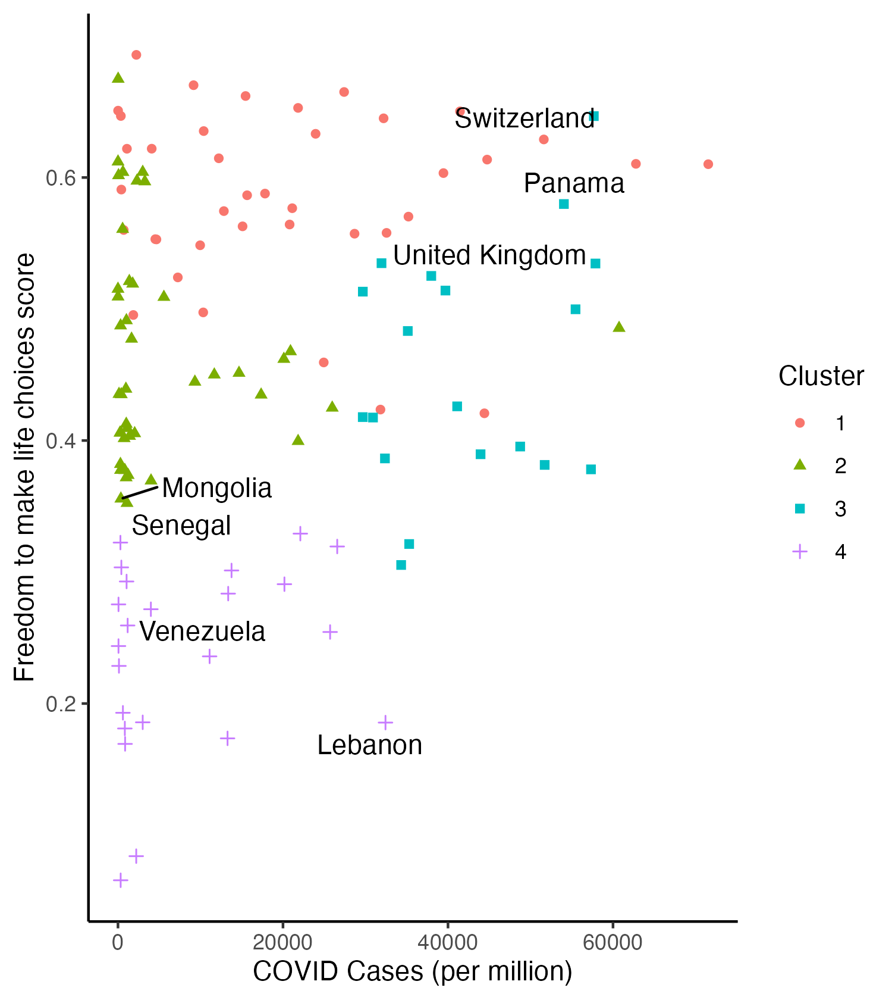

```{r setup, include = FALSE}
# Set code chunk defaults 
# Consider adding `message = FALSE` option
knitr::opts_chunk$set(echo = FALSE) 
                      
# Set R environment options
options(knitr.kable.NA = '')

# Load packages
library(tidyverse)
library(ggplot2)
library(htmlwidgets)
library(plotly)
library(leaflet)
library(viridis)
```

# Intro

In this project, we examined the relationship between the stringency of a country's COVID policy, i.e. the relative freedom allowed the people of the country during the COVID pandemic, and the per capita number of COVID cases that occurred in that country. We also observed how the levels of freedom and corresponding COVID case numbers changed over the three year course of the pandemic for which we have data, i.e. how responses shifted from the 2020 beginnings of the pandemic, to 2021, and up to 2022. To do so, we clustered countries by total number of deaths, total number of cases, and overall happiness score, and, based on these groupings at the start of the pandemic (2020 data) chose a country to examine. Additional countries were selected to ensure that nearly all continents (barring Antarctica and North America) were included. For a country to be considered for further examination, they had to have data for all three years (no North American Country met this requirement, and thus was excluded) and had to have readily available text resources on their COVID policy. Otherwise, countries were chosen at random in an attempt to encompass a broader range of country experiences. We then performed text analysis on the COVID policies of these chosen countries to identify the most commonly used words in their COVID policies, to examine what regulations were present, and how this might have effected their per capita rate of COVID 19 infection within their country.   

# Content

## Freedom of Countries Accross the World According to the World Happiness Report

```{r}
# Reads in our world map datasets
world_happiness_map <- readRDS("data/world_happiness_map.rds") 
```


```{r}
# world_happiness_map20 <- world_happiness_map %>%
#    filter(year == 2020)

ggplot(data = world_happiness_map, aes(geometry = geom, fill = `freedom to make choices`)) +
  geom_sf()+
  theme_void() + # removes axes
  # more informative plot/legend/caption titles
  labs(title = "World Freedom to Make Life Choices in 2020"
       , caption = "Data from Our World in Data and World Happiness Report"
       , fill = "Freedom to Make Life Choices", "Score") +
  # coloring to make chloropleth more readable
  scale_fill_viridis(option = "mako", direction = -1)


```


```{r}
world_happiness_map21 <- world_happiness_map %>%
  filter(year == 2021)

ggplot(data = world_happiness_map21, aes(geometry = geom, fill = `freedom to make choices`)) +
  geom_sf()+
  theme_void() + # removes axes
  # more informative plot/legend/caption titles
  labs(title = "World Freedom to Make Life Choices in 2021"
       , caption = "Data from Our World in Data and World Happiness Report"
       , fill = "Freedom to Make Life Choices", "Score") +
  # coloring to make chloropleth more readable
  scale_fill_viridis(option = "mako", direction = -1)
```


```{r}
# Reads in our world map datasets
world_happiness_map22 <- world_happiness_map %>%
  filter(year == 2022)

ggplot(data = world_happiness_map22, aes(geometry = geom, fill = `freedom to make choices`)) +
  geom_sf()+
  theme_void() + # removes axes
  # more informative plot/legend/caption titles
  labs(title = "World Freedom to Make Life Choices in 2022"
       , caption = "Data from Our World in Data and World Happiness Report"
       , fill = "Freedom to Make Life Choices", "Score") +
  # coloring to make chloropleth more readable
  scale_fill_viridis(option = "mako", direction = -1)
```

## Freedom and COVID Cases - Clustering

```{r, fig.cap='2020 Clustering of COVID Cases vs Country Freedom Score', out.width="100%", fig.align="center"}

```


```{r, fig.cap='2021 Clustering of COVID Cases vs Country Freedom Score', out.width="100%", fig.align="center"}
knitr::include_graphics("img/freedom_death_cluster21.png")
```

```{r, fig.cap='2022 Clustering of COVID Cases vs Country Freedom Score', out.width="100%", fig.align="center"}
knitr::include_graphics("img/freedom_death_cluster22.png")
```


