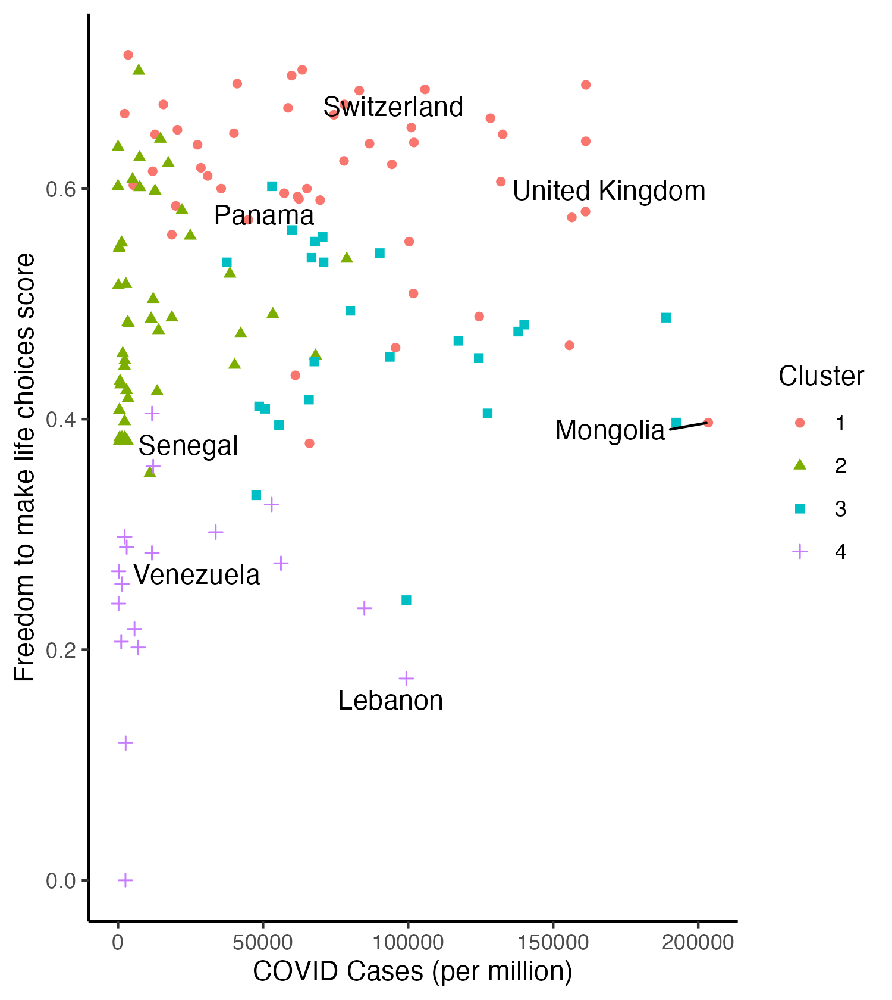
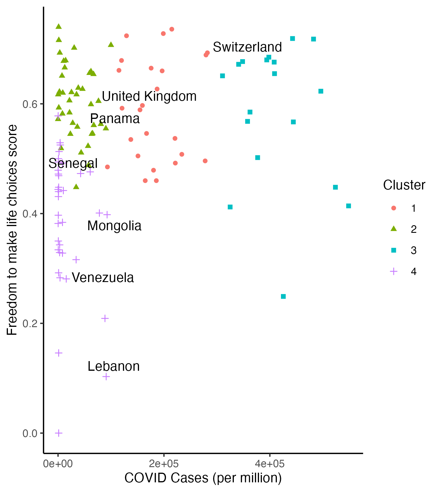

```{r setup, include = FALSE}
# Set code chunk defaults 
# Consider adding `message = FALSE` option
knitr::opts_chunk$set(echo = FALSE) 
                      
# Set R environment options
options(knitr.kable.NA = '')

# Load packages
library(tidyverse)
library(ggplot2)
library(htmlwidgets)
library(plotly)
library(leaflet)
```

# Intro


# Content

## Freedom of Countries Across the World 

### According to the World Happiness Report

```{r, fig.cap='2020 Clustering of COVID Cases vs Country Freedom Score', out.width="80%", fig.align="center"}
knitr::include_graphics("img/freedom_death_cluster20.png")
```


```{r, fig.cap='2021 Clustering of COVID Cases vs Country Freedom Score', out.width="80%", fig.align="center"}

```

```{r, fig.cap='2022 Clustering of COVID Cases vs Country Freedom Score', out.width="80%", fig.align="center"}

```


 


